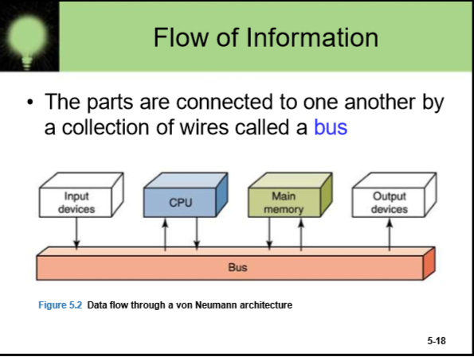

# 软工导论

## information

### Data and Computers

数据表达的信息:(本章多看书)
1. Numbers    
    · (连续量和离散量)
    · computers are finite
    ·analog(连续量) -> digital(离散)
    ·光碟 mp3  --> digital 的可靠性(不易损耗)
>
>·Text <br/>
>·Audio <br/>
>·Images and graphics<br/> 
>·Video<br/>
>·maybe the smell in the future<br/>

### Binary represent

>N bits  --> 2**N events

Why use binary？
> 三极管模拟的开关很便宜

### representing text

character set ---ASCII  刚开始7bits，一位校验用(奇偶校验)，后来用了8bits


>中文编码系统的初始:把ASCII的校验位用于区别汉字系统与ASCII码系统<br/>
>Unicode -> 16bits -> 4个十六进制数 旨在解决编码系统的分歧，每个语言系统有着自己的编码系统，混合使用可能会造成乱码现象，Unicode就在这样的背景下问世了。

### representing color
<pre>   
1. 象形表达
·eg：银星海棠色
2. RGB
 ·人类的生理学构造
 ·人能感知的所有颜色可以用三原色按不同比例混合
 ·打印机(CYMK):追求颜料成本更低的颜色编码系统
 ·显示器每一个点可以发出三种颜色的光(三原色)，再用RGB信号调色
 ·显存用来存二进制码来调控RGB信号
    ·color depth
         1. HiColor  -> 16-bit color depth RGB分别用5bits存
         2. TrueColor -> 24-bit color depth
    ·pixels 像素
        1. pixel by pixel
        2. 显示器重要参数：每英寸多少像素点(dpi or ppi)
        3. dpi -> dot per inch
</pre>            

### Text Compression
1. keyword

    ·统计关键词，用特殊符号代表单词
    
    ·eg: ^ --> as ,   % --> the
        
            
2. run-length
    
    ·重复的字符
    
    ·AAAAAA  -> *A6
    
    ·可用于图像压缩
3. Huffman
    
    ·将使用频率高的字符用更短的编码表示
    
    ·A -> 00 ,  L -> 100;


### representing Audio 
    1. 采量(每秒采样)来逼近真实声音
            ·人类的听觉残留
            ·采样频率越高越逼近analog
            ·一定是有损的
2. WAV AU AIFF VQF MP3


## hardware

### Gates and Circuits

可以先画真值表

>Gate 门电路(要么开要么关)<br/>
Boolean expressions: elegant and powerful<br/>


logic diagrams<br/>
truth table<br/>

    物理基础: transistor(根据输入的信号来表现出是否导通)
        semiconductor(silicon)
        三极管

#### 非门(NOT Gate)
图片见手机<br/>

base给信号电压，source给电位，output输出(接通低电位，断开高电位),ground(接地)<br/>
数学表示:X = A'(" ' " 表示求反)<br/>
逻辑电路图(比较抽象..)  -----|>·----<br/>
真值表(功能)<br/>
一个晶体管


#### NAND gate(与非门)

#### NOR gate(或非门)


#### AND gate
AND gate == NAND gate(输出通向) -> NOT gate<br/>
数学表示:X = A · B(有点像乘法，看真值表就知道了，有时点可省略)<br/>
图太难画...<br/>
三个晶体管<br/>
<br/>

#### OR gate
OR gate = NOR gate -> NOT gate<br/>
数学表示：X = A + B (和加法像，看真值表就知道了)<br/>
三个晶体管<br/>

#### XOR gate(异或门)

数学表示: X = A 异或加号 B


### Circuits
combinational circuit 输入决定输出<br/>
sequential circuit 输入一样不一定能输出一样(电路存值)<br/>

AB + AC = A(B + C)<br/>
circuit equialence(电路等价，看真值表，完全相同则等价)<br/>
画电路图： 先做数学演算，化简，电路图

### Adders


### Circuits as Memory
S-R latch stores   触发器 //set 设置 reset 重置

## Computing Components

### components(冯·诺依曼结构)

电源<br/>
光驱<br/>
硬盘<br/>
显卡(不仅是图像处理，可以利用GPU的强大运算能力)<br/>
主板<br/>
CPU(Arithmetic/logic unit(ALU) and Control unit(发出信号控制逻辑运算单元))<br/>
内存<br/>
<br/>

### memory

collection of cells(each cell has a unique physical address)<br/>
内存大小取决于地址的bits(位数)(决定了计算机的寻址空间)<br/>
>若位数不够买再多内存条都没用(32位计算机仅能支持4G内存)<br/>


<pre>
KB    //2<sup>10</sup>  //10<sup>3</sup>量级
MB    //2<sup>20</sup>  //10<sup>6</sup>量级
GB    //2<sup>30</sup>  //10<sup>9</sup>量级
TB    //2<sup>40</sup>  //10<sup>12</sup>量级
</pre>

计算机最高内存计算方法:看CPU地址线有多少(即CPU是多少位的)<br/>

判断内存低位还是高位优先存数据方法:<br/>
```c
#include <stdio.h>
#include <string.h>
int main()
{
    int a = 10;
    short b;
    memcpy(&b, &a, 2);
    printf("%d", b);
    return 0;
    //输出0，则存储为高位优先
    //输出10，则存储为低位优先
}


```


#### RAM

随机存储<br/>
RAM is voltatile(一关电数据丢失)
##### SRAM
比DRAM更快，常用于缓存
##### DRAM

#### ROM
要占用一部分地址空间<br/>
Read Only Memory(只可读，出厂自带，不可修改，关掉电源仍然可以存储)<br/>
存了指令:让CPU跑起来<br/>
存了指令:调用操作系统<br/>
存了BIOS(Basic input output system)<br/>
其实各个components都要占一些内存

### CPU

地址线，控制线(外部)<br/>
在硅上<b>光刻</b>，工艺越好(几nm)(数字越小，单位面积电路规模更大，发热越低，实现功能越多)<br/>
多核即在CPU面板上多刻几个功能单元<br>
register(faster than cache)用于存用于计算的数据

#### Control Unit
两个特殊的registers：<br/>
instruction register(存当前执行的指令)<br/>
program counter(存下一条指令的地址)

64bits CPU means 64根地址线，ALU 一次算 64 个 bits，64 位的寄存器(?)

#### Cache Memory(缓存)(在CPU内部)
总线可以从内存拿多条指令，但CPU一次执行一条，其余的放缓存里<br/>
因为在CPU内部，从缓存拿东西比从内存里拿更快

<b>内存-> 缓存 -> 寄存器 -> CPU</b>
<b>事实上，CPU只和寄存器交互，寄存器与缓存交互</b>


### BUS
总线，所有components都要和bus交互<br/>
BUS是共享的，独占性<br/>
input -> bus -> cpu <br/>
硬盘 -> 硬盘cache -> bus -> memory<br/>



### Magnetic Disks
同容量，单片更好

<b>多级存储结构</b>:<br/>


带宽:比特率


## Programming Barely
### fetch-decode-execute cycle
一个时钟脉冲做一个循环？

#### fetch the next instruction
#### decoder decode the instruction
#### MXU

### Machine Language
0-1串，CPU只认识百来条指令<br/>
不同CPU的指令集可能不同，很难跨平台<br/>
<br/>
<br/>

### assembly instruction
就是助记符系统，需要翻译器(汇编器？)，一一对应，机器码写的<br/>
跨平台很难
### instruction format
operation code<br/>
register specifier<br/>
addressing-mode<br/>

example:<br/>
1. 000XZZZZ :<br/> 
ZZZZ:操作码<br/>
X:寻址模式(表示操作数是否为内存地址，还是直接是数字)<br/>

#### 语言
动态语言:边解释便执行，有问题可以边运行边改，就是慢<br/>
静态语言:一次翻译成目标代码，有问题得重新编译，但快<br/>
Java是个特例，先把代码编译成bytecode，在JVM(Java Virtual Machine)上运行,(JVM负责解释bytecode)，但字节码有点像机器码，所以后面翻译的过程就像汇编的翻译过程(速度更快？)

一种语言代表一种思维方式<br/>
## Problem Solving and Algorithm Design(top-down method)
<pre>
A book ：personal software process
A BOOK ： <b><i>How to Solve it？</i></b>
What do I know about the problem?
What is the information that I have to process in order to find the solution?
What does the solution look like?
What sort of special cases exist?
How will I recognize that I have found the solution?

对程序，输入输出是什么？
信息，方案？
测试，分析！！  --no answer? LOOK FOR SIMILAR THINGS(现成方案)(YOU SHOULD NEVER REINVENT THE WHEEL)

代码复用，复制(普适性)
</pre>


<pre>
把问题分解成子问题(时间维度，过程)(空间维度，规模)
过程：瀑布模型(时间维度)，有时瀑布会倒流(尽量减少)(细化过程)
项目策划 确定需求 设计 遴选 制作 debug
</pre>

### 算法
有限的时空范围内解决问题的方法
<pre>
伪代码(好习惯，先写伪码再实现，实现后将其变成注释):自由表达算法，不局限于特定的语法，推迟实现，有助于评估
甚至可以全用中文写

关键字加自然语言 -> 加了抽象数据类型的伪代码 -> 实现

test the algorithm:
desk checking:读，看
walk-through:上机打代码
inspection:别人读
</pre>
极限编程，结对编程，可读性>效率(大部分‘工程’，这就是和计算机科学观点不同的地方，我们是工程师)
<pre>
top-down
大局观，模块化分解问题，小问题分逻辑层次
软件框架

解决问题(算法设计，分析，测试) -> 实现算法 -> 测试-> 分析 -> 维护 -> ....
</pre>

design 是你的本钱

### object-oriented

用什么语言来思维
<pre>
动画   --视觉残留，图片刷新
</pre>
<pre>
封装、继承、
</pre>
<pre>
思考方式：这个问题涉及到哪些object
Object是自包含的，有高度的复用性
class instance
object____field
     |____method
把数据和操作数据的函数封装起来  -> object 

属性：名字等

object间有继承关系(is-a)，组成关系(part-of)等
类是概念，是名词
</pre>
```
信息隐藏，抽象
通过概念把问题分解开

识别问题中的对象和类->明确问题相关的属性和行为->研究对象间的关系->由外而内实现(实现前没必要考虑具体实现细节？)

```

```
领域对象
行为集，操作的数据在哪就把行为赋给哪个类
```

### Abstract data types(数据在逻辑上是怎么组织的) 
先组织后计算
伪代码可以先不考虑某些操作的实际实现

#### data structures(数据类型，对象)

```

```

#### containers(容器)  --> 1. 抽象的list
##### Array of homogeneous items(连续的内存块，physically same as logically)<br/>
基于数组的容器，有序或无序

##### Linked list(node结点,内存在物理上不一定连续)
```c
struct node{
    int value;
    struct node* next;
}
```
基于链表的容器，便于插入新数据，便于删除某个数据，不便于遍历链表

##### 对比
可以混合，node的字段可以是数组
<pre>
花费空间:数组少
按index访问数据：数组快
查找：
    无序：两个都只能一个个找
    有序：数组有更好的查找算法(链表的二分法可能比较低效)
插入和删除数据：链表方便    
</pre>

##### 总结
抽象的容器 ： 表(List)(具体实现视情况而定)
使用抽象数据类型而不是具体实现的好处：给了评估的机会，以防出错
<pre>
List operations
    Create itself
    Insert an item
    Delete an item
    Print itself
    Know the number of items it contains
</pre>

#### algorithm(要么时间换空间，要么空间换时间)
##### 二分搜索
先排序再搜索
```
binary_search(book, bookshelfs){ //二分查找，仅用于有序容器
    goto the middle bookshelf of the bookshelfs
    IF mybook.index_number > to_number THEN 
        binary_search(mybook, frontal bookshelfs)
    END IF
    IF mybook.index_number < to_number THEN 
        binary_search(mybook, posterior bookshelfs)
    END IF
    IF mybook.index_number == to_number THEN
        return bookshelf.findByIndex(mybook.book_index)
    ENDIF      

}
```
```c
int binary_search(int *data, int size, int num){
	int left = 0;
	int right = size - 1;
	while (right >= left){
		int mid = left + (right - left) / 2;
		if (data[mid] == num) return mid;
		if (data[mid] > num){
			right = mid - 1;
		}
		else{
			left = mid + 1;
		}
	}
	return -1;
}
```
##### selection sort
```c
void selection_sort(int* data, int size){
    for (int i = 0; i < size ; ++ i){
        for (int j = i + 1; j < size ; ++ j){
            if (data[i] > data[j]){
                int temp = data[i];
                data[i] = data[j];
                data[j] = temp;
            }
        }
    }
}
``` 
```c
READ list
// FOR EACH item in list:
//     find the minimum in the new list(including the item and the ones after it)
//     exchange(minimum, item)
// END FOR
FOR i from 0 to list.length - 2
    Find index of the minimum in list[i, list.length - 1]
    IF index <> i(大于或小于) THEN
        list.swap(i,index)
    END IF
END FOR        
```
##### Bubble sort
```c
void bubble_sort(int *data, int size){
    for (int i = size - 1; i > 0 ; --i){
        for (int j = 0; j < i ; ++ j){
            if (data[j] > data[j + 1]){
                int temp = data[j];
                data[j] = data[j + 1];
                data[j + 1] = temp;
            }
        }
    }
}
```
```c
READ list
FOR i from list.length - 1 to 0


```
##### quick sort
```
随机抽一个
大的放一堆
小的放一堆
递归每一堆
_(:з」∠)_
记得自己实现
```
· 找到top200

#### containers --> 2. stack(栈，有点像子弹夹)
<pre>
LIFO --> Last in First out(后进先出)
pop
push
</pre>

#### containers --> 3. queue(队列，有点像排队)
<pre>
FIFO --> First in First out(先进后出)
</pre>


## Operating system(sharing nicely)
应用软件，满足特定需求，运行在系统软件之上，调用系统给的接口API,(application programming interface)不需要管底层的实现细节，直接调用接口

系统软件，底层软件，管理资源(输入输出，CPU，网络)，提供与人交互的界面，让应用程序来使用资源

操作系统，管理和配置内存，绝对系统资源供需的优先次序、看着输入与输出设备、操作网络与管理文件系统等基本事物。

DOS (Disk Operating System) ---Microsoft history

process(A program in execution)  --进程

timesharing system    ---virtual machine

Logical address  --定义变量时会申请一个地址<br/>
Physical address  --转化加个偏移量就行了，加上操作系统的内存占用

>there are only two programs in memory, operating system and application program.

Base register ---存地址开始的地址<br/>
Bounds register  ---存进程的长度...

内存分配 ---{<br/>
    fitst fit<br/>
    best fit<br/>
    worst fit<br/>
}

<pre>
Paged Memory Management 
    ·page -> frame
    ·用的少的page淘汰，没放进去的程序部分都放在硬盘上
    ·虚拟内存了解下，当有太大的进程运行不了时，可以改改虚拟内存
Process Management
    ·进程(process) New ->(admitted) ready(可能不止一个) -> running <---> waiting -> 继续ready
        (or)--> terminate
PCB Process Control Block ----> 进程 + PC寄存器指令 + 寄存器值 ，CPU通常和PCB们打交道，load into registers，store into memory

CPU Scheduling   --> determine which process should be running
Nonpreemptive scheduling --进程只有自己放弃CPU，操作系统不强制
Preemptive scheduling  --操作系统可以强制当前进程结束
Turnaround time     --分时
相关策略: FCFS --先来先服务
         SJN  --短任务优先
         RR   --分时，时间片(与人交互)
 
</pre>

## Network & WWW
Computer network   wireless connection<br/>
Data transfer rate and distance<br/>

node，网络的个体单位<br/>
Client/server model ： request response<br/>
 
File server : FTP协议，文件上传，文件下载<br/>
Web server  ：HTTP协议，浏览器<br/>

LAN ：Local Area Network局域网<br/>
    Ring topology ： 环形<br/>
    Star topology ： 主机模式，任两台要通信需经过主机<br/>
    Bus topology(以太网)  ： 总线<br/>
WAN ：Wide-area Network广域网，把局域网连在一起，选出局域网的代表(网关，路由器)<br/>
MAN ：Metropolitan-area Network城域网<br/>
路由器的真·IP是全世界唯一的，但局域网内的地址是可以自己分配的

Internet backbone<br/>
Internet service provider(ISP) 网络服务商，常用DSL的接入方式<br/>
phone modem(电话线) ： 上网时不能打电话，模拟信号<br/>
digital subscriber line(DSL, 也用电话线) ： 上网可以打电话，数字通信<br/>  
cable modem ： 光纤，电缆<br/>

Broadband (带宽)，每秒的最大数据流量<br/>
    一般， 下载速度 >> 上传速度，服务商宣传的都是下载速度

Packet Switching(包交换，数据传输手段)<br/>
    先把数据分成固定大小的"包"(减少error概率)<br/>
    **路由器**来规划‘包’走的路线，可能先发后到<br/>
    接包端等所有包到齐了再组合给用户看<br/>

ISO 国际标准化组织 --> OSI 开放系统模型  --> 7层协议标准(实现封装在网卡驱动里)<br/>
'包'的管理在第三层'network layer'实现<br/>
路由器要实现第三层，通常内置防火墙(也是第三层)<br/>
session:会话，权限<br/>

<b>协议栈</b><br/>
SMTP(发邮件)、FTP(文件传输)、Telnet(远程登录) -> TCP、UDP -> IP协议<br/>
TCP: 把messages 分成 packets ，发送到相应IP地址，并要求对方校验发包回来，用于数据可靠性要求高的场景<br/>
UDP: 相比于TCP的可靠，性能差，UDP牺牲可靠性，提升了性能，用于效率要求高的场景<br/>
SMTP，FTP，Telnet协议都是基于上述的应用级的协议<br/>
端口：(各个协议有默认的接收端口，端口可以改变，对方不知道就没法使用这些服务)

MIME 格式<br/>
防火墙(firewalls) ：过滤器(Filters) (例如：筛选掉特定端口的访问，特定ip地址的访问，甚至是包内容的筛选(病毒筛选))

**网络地址**<br/>
域名：标识结点(eg: ecw.sysu.edu.cn)，网络软件会把域名翻译成相应的IP地址
    IP地址，路由器的IP是全世界唯一的，但局域网内的ip是自己分配的
    ipv4，ipv6：分别用4个字节，6个字节   
域名的最后一段TLD，是顶级域，一般是国家，或者别的什么<br/>    
DNS服务器 : domain name system 翻译域名的工作，其实是分布式数据库
    先把域名传给DNS服务器，让它翻译成IP地址，再返回给用户<br/>
    如果曾经翻译过，本机会保存已经翻译过的域名，没有才向DNS服务器要，上一级的DNS服务器数据库里没有再向上一级要，(比如：我向学校DNS服务器要，学校向中国电信DNS服务器要，中国电信向美国要)<br/>
    **命令行的ping命令可以将域名翻译成IP地址**<br/>

# 软件工程： 广义的编程
## 做软件 != 编程
软件 = 程序 + 文档 + 数据<br/>
工程 = 系统(步骤明确) + 规范(标准明确) + 可度量(标准可评估)<br/>
### 果然软件工程 = 写代码 + 秃头 + 颈椎病 + 玄学 + 人体工程学
## 需求分析师： 进度条很重要，人很重要，<del>项目经理</del>客户就是上帝(需求分析，难点)
## 架构师： 先考虑结构设计：模块化(软件设计)，伪代码(算法)
## 不再造轮子：middleware 
## 配置管理(<del>防止程序员跑路</del>控制变化) + 质量管理(控制错误) + 计划与进度管理(控制时间) + 风险管理(控制意外，工资差在%20以上就危险了) + 费用管理(控制预算) + 人员管理(控制人力)

## 软工的目的：在规定时间、费用内，作出符合质量要求的软件，并不要求最新的技术

## 专业人员必备的个人素质
1) **基础理论**：训练分析解决问题的能力，深层研究的工
具。数学分析训练严密的逻辑思维。普通物理和西方哲
学史等教会你很多思维方式，比如：假说——大胆假设、
认真求证。
2) **专业理论**：数据库理论、网络基础、编译原理等。
3) 专业技术：程序设计语言等。
4) 工程技术：软件工程，本、研教育中唯一涉及工程
规范与管理的课程，它象粘合剂，技术经过它的粘合才
能形成软件产品！
5) **外语**。多门语言多条路。
6) 表达与交流能力：团队内部、与客户通讯的基本素质
7) 法律常识与职业道德：知识产权保护、行业特点的职
业道德

## 软工的知识体系——三个层次
回绕质量目标的三个层次： 
1) 过程：做什么 模型、流程、标准——对应管理要素。 关
键过程域KPA。定义了方法使用的顺序、要求交付的文档资料、
为保证质量和协调变更所需要的管理、里程碑、项目管理、人
员组织等。 
2) 方法：如何做 往往采用某种特殊的语言或图形表达方法及
一套质量保证标准——对应技术要素。项目计划与估算、需求
分析、总体设计、详细设计、编码、测试及维护的具体做法和
基本原则。 
3) 工具：对方法的支撑，自动或半自动的软件开发支撑环境 CASE。

## 典型划分GB8567（4个时期7个阶段）：
1) 软件分析时期：问题定义、可行性研究、需求分析
2) 软件设计时期：总体设计、详细设计
3) 编码与测试时期：编码、测试
4) 运行与维护时期

## 软件开发模型
1) 瀑布模型：适合小型的，回流的时候成本会大幅提高
2) 原型模型
3) 增量模型：先做一部分，软件更新(小团队做大软件的策略)
4) 螺旋模型：大团队做高风险的软件
5) 喷泉模型：著名的RUP模型


